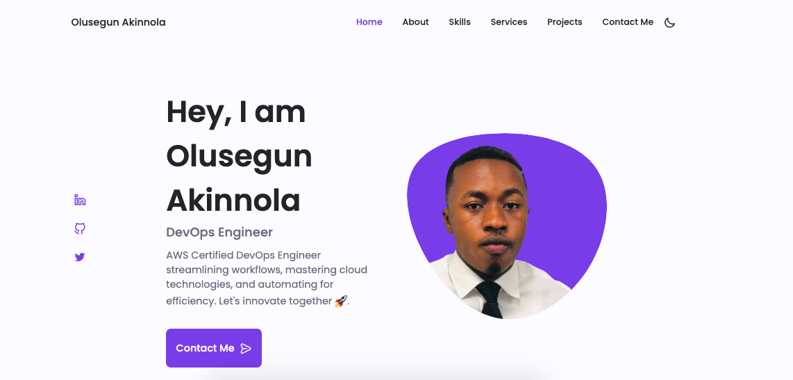
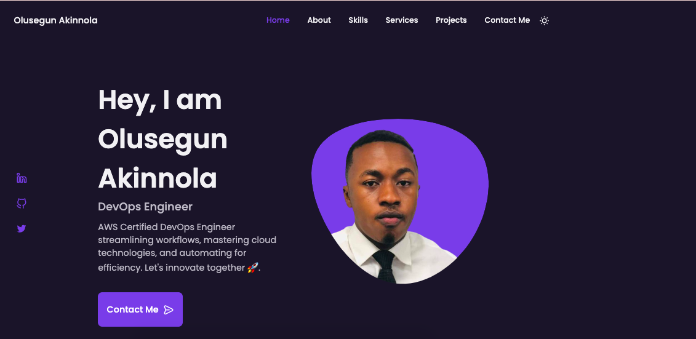
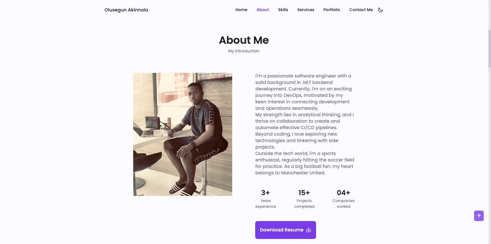
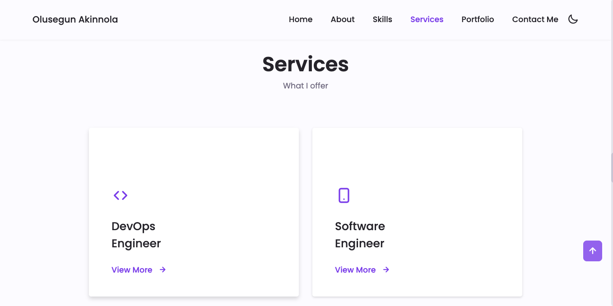
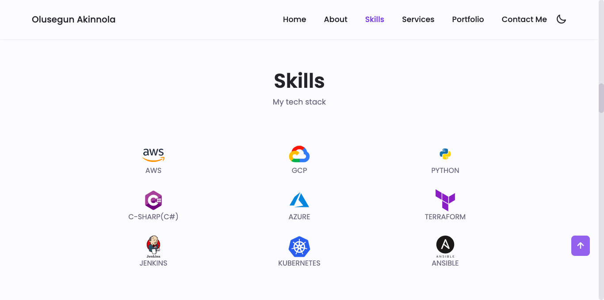
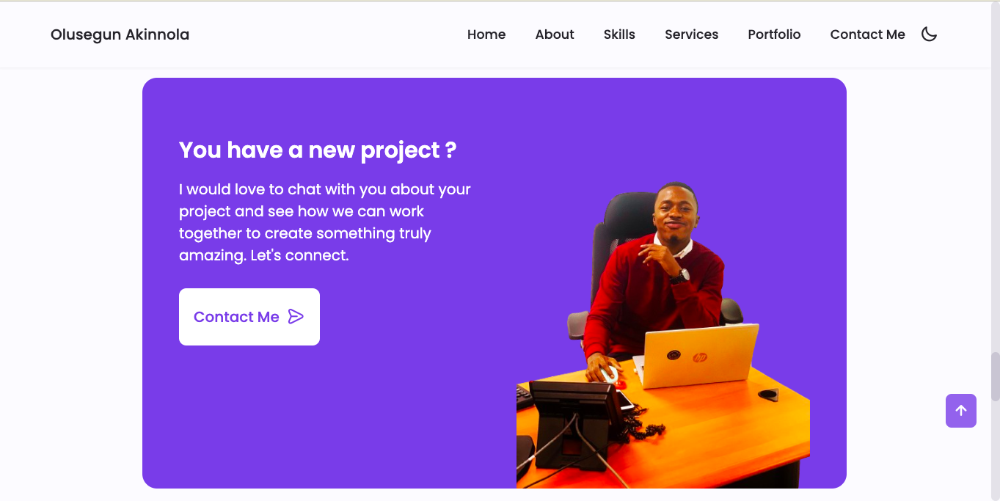
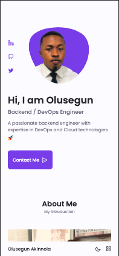
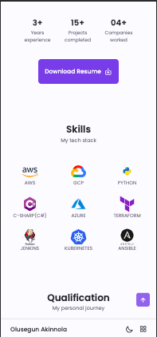
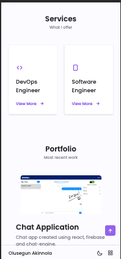
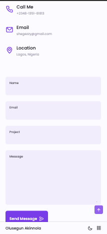

# Olusegun Akinnola Personal Portfolio Website 
A great professional Portfolio website of Olusegun Akinnola. A summary of my professional experience, skills, projects details and contact information.

## Feature List and Screenshots
### [Visit Website](https://olusegunakinnola.netlify.app/)

### Features
```
1. Dark and Light themes
2. Auto switch to dark mode based on browser/OS setting
3. PWA features
4. Offline caching
5. Fully responsive for all screen sizes


### Improvements
```
1. Improve lighthouse score
```

### Switch between light and dark theme




### Other sections of portfolio website






### Mobile and Tablet responsive layout






## Author

Email - shegezzy@gmail.com
Portfolio - https://olusegunakinnola.netlify.app
